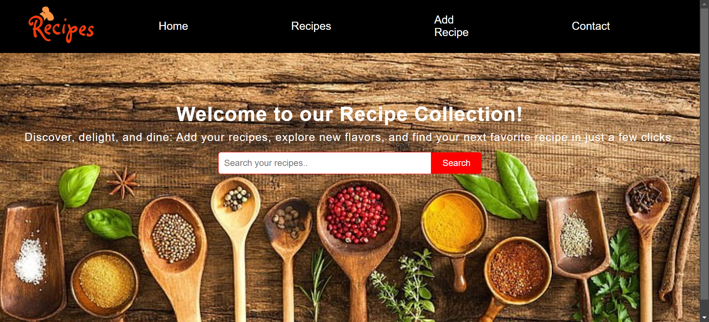
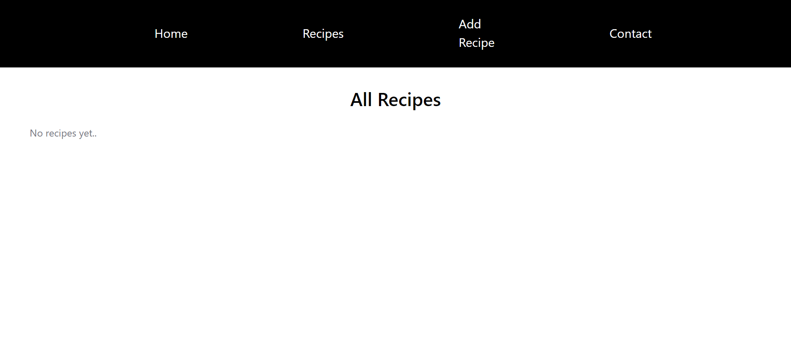
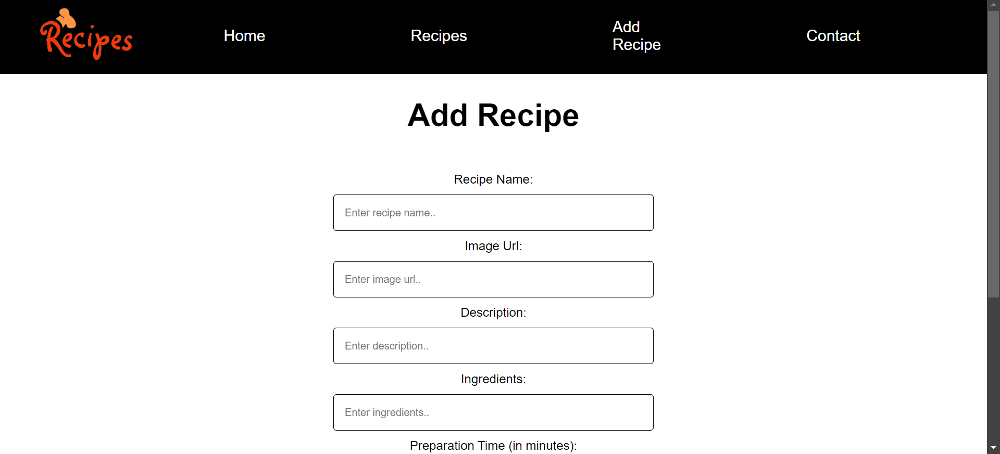
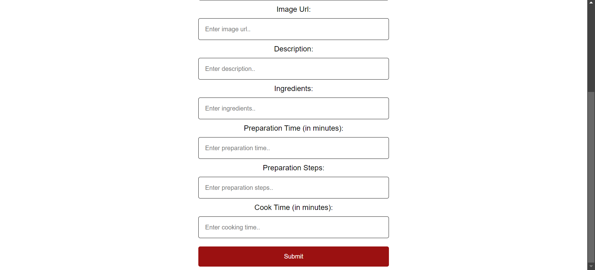
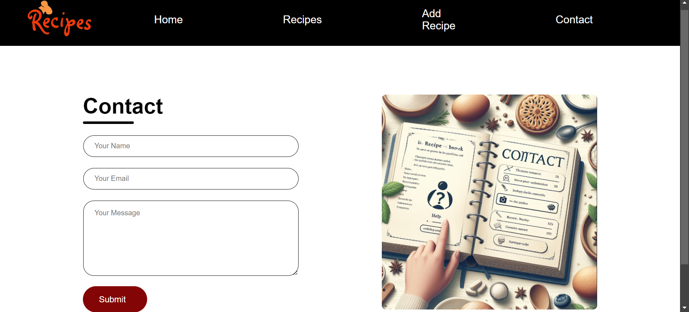

# Recipe Book

Welcome to the Recipe Book project! This repository features a curated collection of recipes to help you discover and cook a variety of delicious dishes. From appetizers to desserts, our goal is to provide a comprehensive resource for food enthusiasts of all levels.

## Table of Contents

- [Home](/)
- [View Recipe](/recipe)
- [Add Recipe](/add)
- [Contact](/contact)

## Technologies Used

- **Frontend**: HTML, CSS, JavaScript
- **Backend**: Node.js, Express.js
- **Database**: MongoDB (or your choice of database)

## Screenshots

To provide a better understanding of the Recipe Book application, here is a screenshot showcasing the main interface:

##Main Interface

##Recipe Interface

##Add Recipe Interface

##Contact Interface

Feel free to customize this template according to your project's specific needs and details!

For any inquiries, please contact:

Name: Gauranshi Varshney
Email: gauranshivarshney@gmail.com
